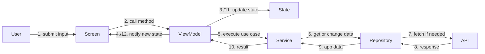
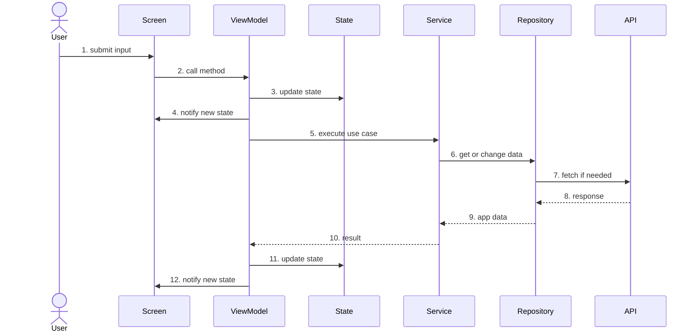
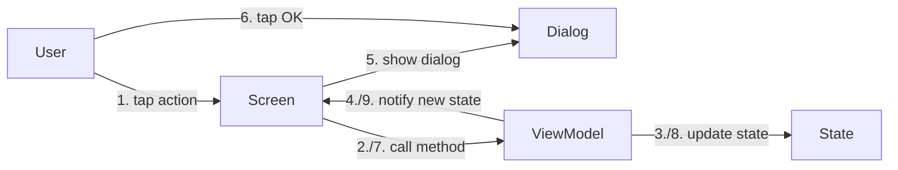
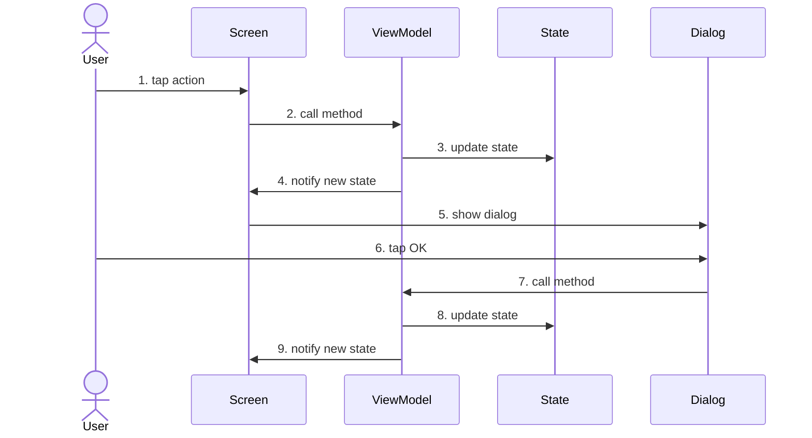
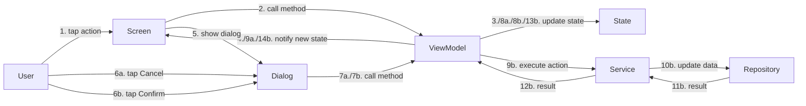
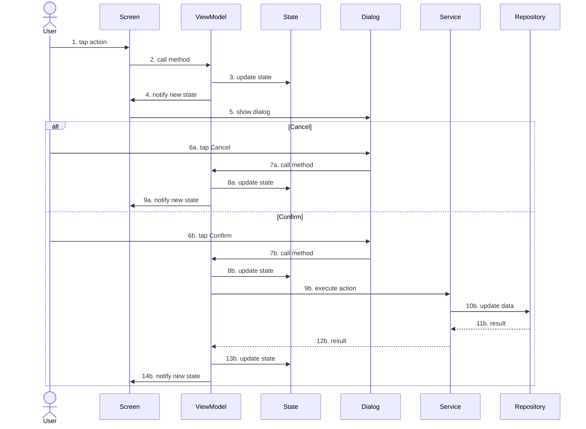

# Frontend UML V2

This version keeps the diagrams intentionally small.
The focus is on the main interaction path, not on every implementation detail.

The existing diagrams are best described as `interaction flow diagrams` or simple `flowcharts`.
They are useful for quick reading because they show the main path without full time-lane detail.

## Standard Interaction

### Sequence Diagram

## Information Dialog

### Sequence Diagram

## Decision Dialog

### Sequence Diagram

