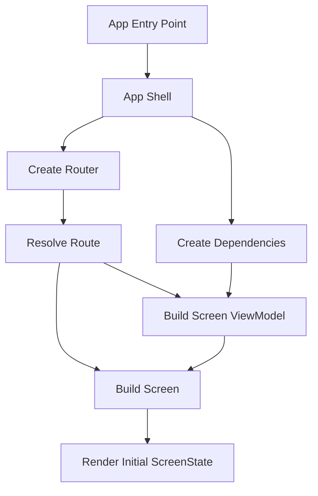
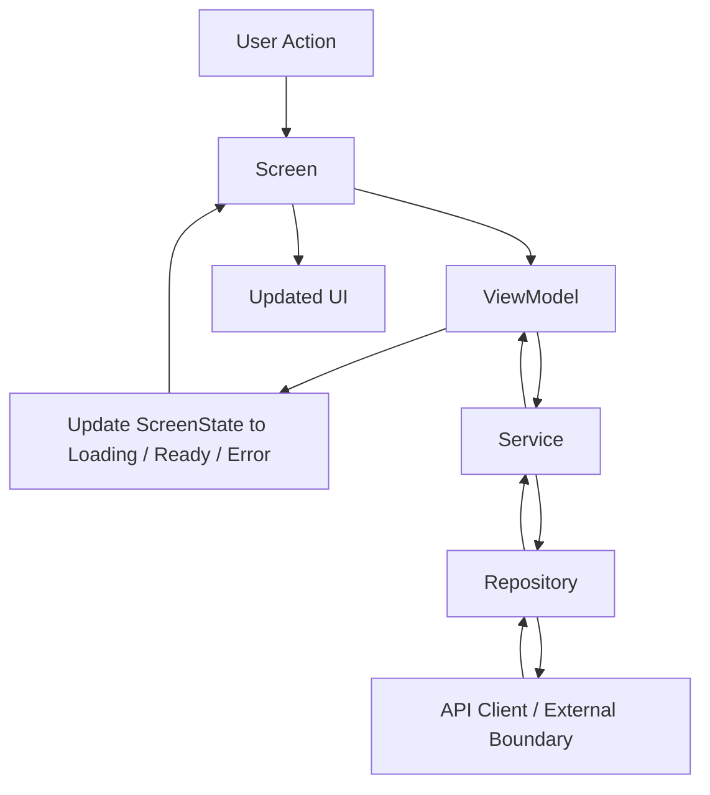
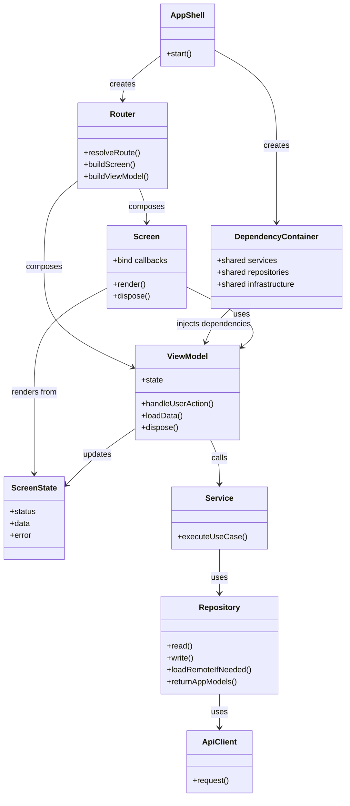
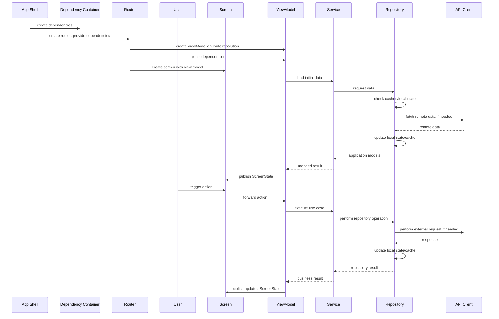

# Frontend Screen Flow UML

This document describes a general frontend structure for a Flutter app that uses:

- app-wide dependency setup
- centralized routing
- screen-local view models
- explicit screen state
- services and repositories as boundaries to external systems

The goal is to make both the creation flow and the runtime usage flow easy to understand.

In this model, a repository is the data access boundary.
It may read cached or stored data, call remote APIs when needed, update its local state, and return application-facing models.
Services coordinate use cases on top of repositories instead of owning the transport logic themselves.

## Core Idea

A screen is not created in isolation.
It is usually assembled through a small chain:

1. the app starts
2. shared dependencies are created once
3. the router resolves a route
4. the router builds the screen and injects its view model
5. the view model calls services
6. services use repositories
7. repositories decide between cached, stored, and remote data
8. the screen renders from a single screen state

## Screen Creation Flow

This diagram shows how a screen gets constructed.

## Runtime Usage Flow

This diagram shows how the parts communicate during usage after the screen is created.

## Layer Structure

This class-style UML shows the responsibilities and connections between the main parts.

## Sequence: Create And Use A Screen

This sequence combines creation and later usage in one timeline.

## Responsibilities

- `App Shell`
  Creates the app-wide foundation and starts the UI.

- `Dependency Container`
  Holds shared services, repositories, configuration, logging, and other app-wide dependencies.

- `Router`
  Central place that resolves routes and composes a screen together with its view model.

- `Screen`
  Owns widget composition, lifecycle, and binding between UI callbacks and the view model.

- `ViewModel`
  Coordinates screen behavior, exposes one screen state, and translates service results into UI state.

- `ScreenState`
  The single source of truth for what the screen should render.

- `Service`
  Holds application logic and use-case orchestration that should not live in the UI.

- `Repository`
  Owns data access.
  It may read from memory, cache, local persistence, or remote APIs, then return application-facing models.

- `API Client`
  Talks to external systems such as HTTP backends.
  It is a transport detail used by repositories.

## Recommended Boundary Rules

1. Screens and view models do not talk to API clients directly.
2. Services coordinate use cases and business flows.
3. Repositories own data access and freshness decisions.
4. Repositories may call remote APIs when cached or stored data is missing or stale.
5. Repositories should return application-facing models, not raw transport DTOs.
6. API clients should stay low-level and transport-focused.
7. If fresh data is required, make it explicit through repository APIs, for example with a `forceRefresh` option.

## Practical Reading Guide

If you want to understand a page quickly, read it in this order:

1. `Screen`
2. `ViewModel`
3. `ScreenState`
4. `Service`
5. `Repository`
6. `API Client`

That order usually tells you:

- how the page is created
- what user actions it supports
- how state changes
- where data comes from
- how external communication happens
